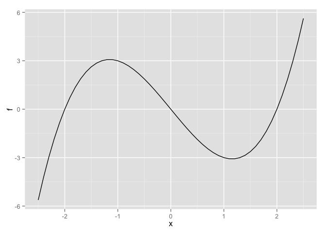
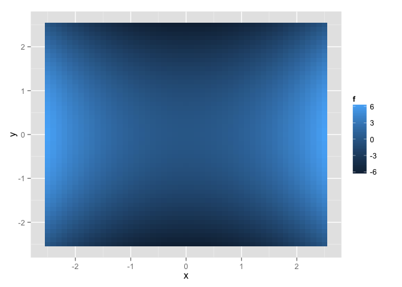
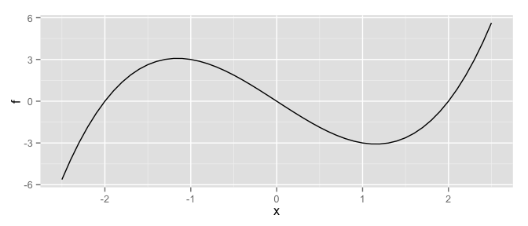

<!-- README.md is generated from README.Rmd. Please edit that file -->


mpoly
=====

**mpoly** is a simple collection of tools to help deal with multivariate polynomials *symbolically* and functionally in R. Polynomials are defined with the `mp` function:

``` {.r}
library(mpoly)
#> Loading required package: stringr
mp("x + y")
#> x  +  y
mp("(x + 4y)^2 (x - .25)")
#> x^3  -  0.25 x^2  +  8 x^2 y  -  2 x y  +  16 x y^2  -  4 y^2
```

[Term orders](http://en.wikipedia.org/wiki/Lexicographical_order#Monomials) are available with the reorder function:

``` {.r}
(p <- mp("(x + y)^2 (1 + x)"))
#> x^2  +  x^3  +  2 x y  +  2 x^2 y  +  y^2  +  x y^2
reorder(p, varorder = c('y','x'), order = 'lex')
#> y^2 x  +  y^2  +  2 y x^2  +  2 y x  +  x^3  +  x^2
reorder(p, varorder = c('x','y'), order = 'glex')
#> x^3  +  2 x^2 y  +  x y^2  +  x^2  +  2 x y  +  y^2
```

Arithmetic is defined for them (`+`, `-`, `*` and `^`):

``` {.r}
p1 <- mp("x + y")
p2 <- mp("x - y")

p1 + p2
#> 2 x
p1 - p2
#> 2 y
p1 * p2
#> x^2  -  y^2
p1^2
#> x^2  +  2 x y  +  y^2
```

You can compute derivatives easily:

``` {.r}
deriv(mp("x + x y + x y^2"), "y")
#> x  +  2 x y
```

And turn them into functions you can evaluate:

``` {.r}
f <- as.function(mp("(x-2) x (x+2)"))
#> f(x)
s <- seq(-2.5, 2.5, .1)
df <- expand.grid(x = s)
df$f <- apply(df, 1, f)

library(ggplot2)
qplot(x, f, data = df, geom = "line")
```



``` {.r}
f <- as.function(mp("x^2 - y^2")) 
#> f(.) with . = (x, y)
df <- expand.grid(x = s, y = s)
df$f <- apply(df, 1, f)
qplot(x, y, data = df, geom = "tile", fill = f)
```



I'm starting to put in methods for some other R functions:

``` {.r}
n <- 101
df <- data.frame(x = seq(-5, 5, length.out = n))
df$y <- with(df, -x^2 + 2*x - 3 + rnorm(n, 0, 2))

mod <- lm(y ~ x + I(x^2), data = df)
(p <- round(as.mpoly(mod)))
#> -2.898  +  1.973 x  -  1.004 x^2
qplot(x, y, data = df) +
  stat_function(fun = as.function(p), colour = 'red')
#> f(x)
```



Grobner bases computations are available using **rSymPy**:

``` {.r}
polys <- mp(c("t^4 - x", "t^3 - y", "t^2 - z"))
grobner(polys)
#> using variable ordering - t, x, y, z
#> Loading required package: rJava
#> -1 z  +  t^2
#> t y  -  z^2
#> -1 y  +  z t
#> x  -  z^2
#> y^2  -  z^3
```

Installation
------------

-   From CRAN: `install.packages("mpoly")`

-   From Github (dev version):

    ``` {.R}
    # install.packages("devtools")
    devtools::install_github("Rexamine/stringi")
    devtools::install_github("hadley/stringr")
    devtools::install_github("dkahle/mpoly")
    ```
