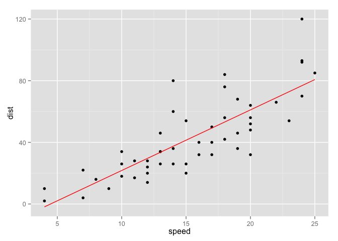
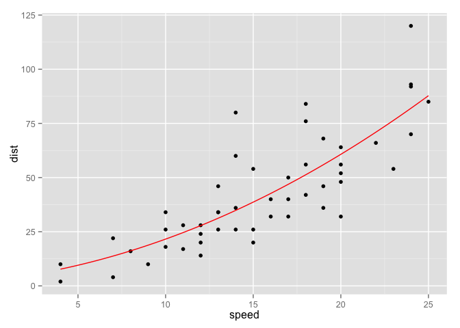

<!-- README.md is generated from README.Rmd. Please edit that file -->


mpoly
=====

mpoly is a simple collection of tools to help deal with multivariate polynomials *symbolically* and functionally in R.

``` {.r}
library(mpoly)

p1 <- mp("x + y")
p2 <- mp("x - y")

p1 * p2
p1^2


library(ggplot2)
(p <- round(as.mpoly(lm(dist ~ speed, data = cars))))
qplot(speed, dist, data = cars) +
  stat_function(fun = as.function(p), color = "red")
```



``` {.r}

(p <- round(as.mpoly(lm(dist ~ speed + I(speed^2), data = cars))))
qplot(speed, dist, data = cars) +
  stat_function(fun = as.function(p), color = "red")
```



Installation
------------

-   From CRAN: `install.packages("mpoly")`

-   From Github (dev version):

    ``` {.R}
    # install.packages("devtools")
    devtools::install_github("Rexamine/stringi")
    devtools::install_github("hadley/stringr")
    devtools::install_github("dkahle/mpoly")
    ```
