<!-- README.md is generated from README.Rmd. Please edit that file -->
mpoly
=====

Specifying polynomials
----------------------

**mpoly** is a simple collection of tools to help deal with multivariate polynomials *symbolically* and functionally in R. Polynomials are defined with the `mp()` function:

``` r
library(mpoly)
# Loading required package: stringr
mp("x + y")
# x  +  y
mp("(x + 4y)^2 (x - .25)")
# x^3  -  0.25 x^2  +  8 x^2 y  -  2 x y  +  16 x y^2  -  4 y^2
```

[Term orders](http://en.wikipedia.org/wiki/Lexicographical_order#Monomials) are available with the reorder function:

``` r
(p <- mp("(x + y)^2 (1 + x)"))
# x^3  +  x^2  +  2 x^2 y  +  2 x y  +  x y^2  +  y^2
reorder(p, varorder = c("y","x"), order = "lex")
# y^2 x  +  y^2  +  2 y x^2  +  2 y x  +  x^3  +  x^2
reorder(p, varorder = c("x","y"), order = "glex")
# x^3  +  2 x^2 y  +  x y^2  +  x^2  +  2 x y  +  y^2
```

Vectors of polynomials (`mpolyList`'s) can be specified in the same way:

``` r
mp(c("(x+y)^2", "z"))
# x^2  +  2 x y  +  y^2
# z
```

Polynomial parts
----------------

You can extract pieces of polynoimals using the standard `[` operator, which works on its terms:

``` r
p[1]
# x^3
p[1:3]
# x^3  +  x^2  +  2 x^2 y
p[-1]
# x^2  +  2 x^2 y  +  2 x y  +  x y^2  +  y^2
```

There are also many other functions that can be used to piece apart polynomials, for example the leading term (default lex order):

``` r
LT(p)
# x^3
LC(p)
# [1] 1
LM(p)
# x^3
```

You can also extract information about exponents:

``` r
exponents(p)
# [[1]]
# x y 
# 3 0 
# 
# [[2]]
# x y 
# 2 0 
# 
# [[3]]
# x y 
# 2 1 
# 
# [[4]]
# x y 
# 1 1 
# 
# [[5]]
# x y 
# 1 2 
# 
# [[6]]
# x y 
# 0 2
multideg(p)
# x y 
# 3 0
totaldeg(p)
# [1] 3
monomials(p)
# x^3
# x^2
# 2 x^2 y
# 2 x y
# x y^2
# y^2
```

Polynomial arithmetic
---------------------

Arithmetic is defined for both polynomials (`+`, `-`, `*` and `^`)...

``` r
p1 <- mp("x + y")
p2 <- mp("x - y")

p1 + p2
# 2 x
p1 - p2
# 2 y
p1 * p2
# x^2  -  y^2
p1^2
# x^2  +  2 x y  +  y^2
```

... and vectors of polynomials:

``` r
(ps1 <- mp(c("x", "y")))
# x
# y
(ps2 <- mp(c("2x", "y+z")))
# 2 x
# y  +  z
ps1 + ps2
# 3 x
# 2 y  +  z
ps1 - ps2
# -1 x
# -1 z
ps1 * ps2
# 2 x^2
# y^2  +  y z
```

Some calculus
-------------

You can compute derivatives easily:

``` r
p <- mp("x + x y + x y^2")
deriv(p, "y")
# x  +  2 x y
gradient(p)
# y^2  +  y  +  1
# 2 y x  +  x
```

Function coercion
-----------------

You can turn polynomials and vectors of polynomials into functions you can evaluate with `as.function()`. Here's a basic example using a single multivariate polynomial:

``` r
f <- as.function(mp("x + 2 y")) # makes a function with a vector argument
# f(.) with . = (x, y)
f(c(1,1))
# [1] 3
f <- as.function(mp("x + 2 y"), vector = FALSE) # makes a function with all arguments
# f(x, y)
f(1, 1)
# [1] 3
```

Here's a basic example with a vector of multivariate polynomials:

``` r
(p <- mp(c("x", "2 y")))
# x
# 2 y
f <- as.function(p) 
# f(.) with . = (x, y)
f(c(1,1))
# [1] 1 2
f <- as.function(p, vector = FALSE) 
# f(x, y)
f(1, 1)
# [1] 1 2
```

Whether you're working with a single multivariate polynomial or a vector of them (`mpolyList`), if it/they are actually univariate polynomial(s), the resulting function is vectorized. Here's an example with a single univariate polynomial.

``` r
f <- as.function(mp("x^2"))
# f(.) with . = x
f(1:3)
# [1] 1 4 9
(mat <- matrix(1:4, 2))
#      [,1] [,2]
# [1,]    1    3
# [2,]    2    4
f(mat) # it's vectorized properly over arrays
#      [,1] [,2]
# [1,]    1    9
# [2,]    4   16
```

Here's an example with a vector of univariate polynomials:

``` r
(p <- mp(c("t", "t^2")))
# t
# t^2
f <- as.function(p)
# f(.) with . = (t)
f(1)
# [1] 1 1
f(1:3)
#      [,1] [,2]
# [1,]    1    1
# [2,]    2    4
# [3,]    3    9
```

You can use this to visualize a univariate polynomials like this:

``` r
f <- as.function(mp("(x-2) x (x+2)"))
# f(.) with . = x
x <- seq(-2.5, 2.5, .1)

library(ggplot2); theme_set(theme_classic())
qplot(x, f(x), geom = "line")
```

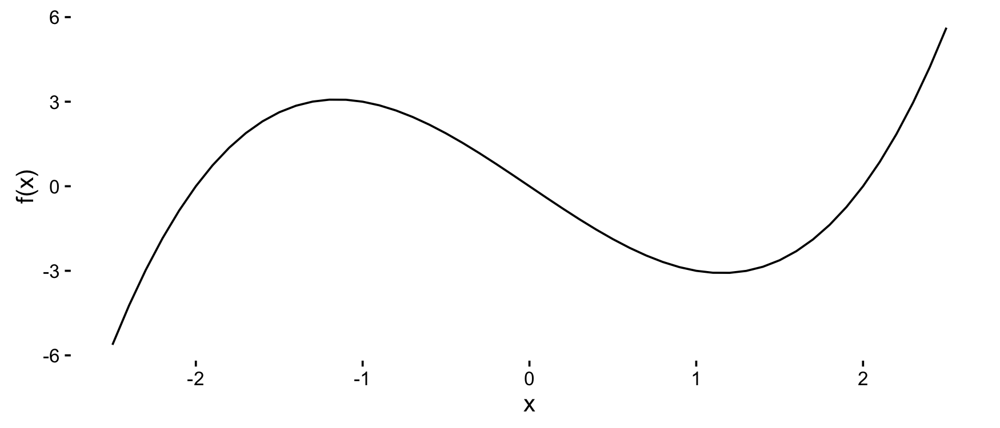

For multivariate polynomials, it's a little more complicated:

``` r
f <- as.function(mp("x^2 - y^2")) 
# f(.) with . = (x, y)
s <- seq(-2.5, 2.5, .1)
df <- expand.grid(x = s, y = s)
df$f <- apply(df, 1, f)
qplot(x, y, data = df, geom = "tile", fill = f)
```

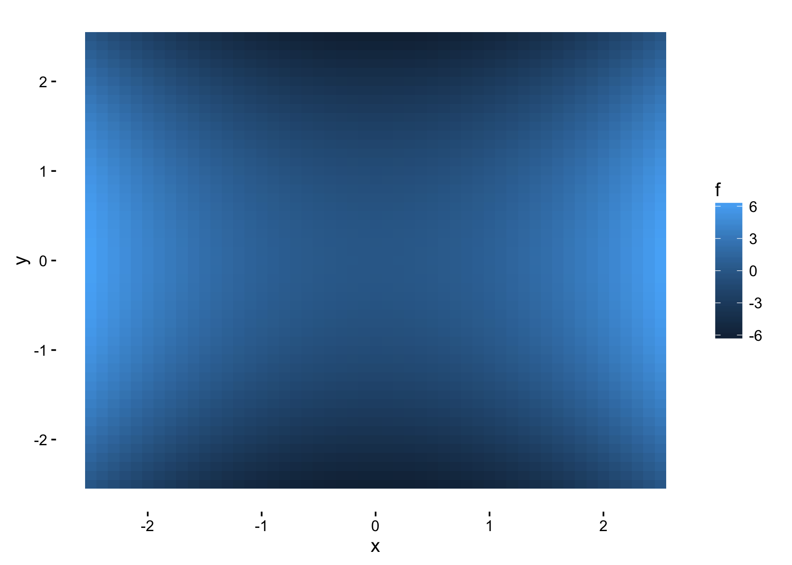

Algebraic geometry
------------------

**Grobner bases are no longer implemented, see [m2r](https://github.com/musicman3320/m2r)**

``` r
# polys <- mp(c("t^4 - x", "t^3 - y", "t^2 - z"))
# grobner(polys)
```

Homogenization and dehomogenization:

``` r
(p <- mp("x + 2 x y + y - z^3"))
# x  +  2 x y  +  y  -  z^3
(hp <- homogenize(p))
# x t^2  +  2 x y t  +  y t^2  -  z^3
dehomogenize(hp, "t")
# x  +  2 x y  +  y  -  z^3
homogeneous_components(p)
# x  +  y
# 2 x y
# -1 z^3
```

Special polynomials
-------------------

**mpoly** can make use of many pieces of the **polynom** and **orthopolynom** packages with `as.mpoly()` methods. In particular, many special polynomials are available.

#### [Chebyshev polynomials](http://en.wikipedia.org/wiki/Chebyshev_polynomials)

You can construct [Chebyshev polynomials](http://en.wikipedia.org/wiki/Chebyshev_polynomials) as follows:

``` r
chebyshev(1)
# Loading required package: polynom
# 
# Attaching package: 'polynom'
# 
# The following object is masked from 'package:mpoly':
# 
#     LCM
# x
chebyshev(2)
# -1  +  2 x^2
chebyshev(0:5)
# 1
# x
# 2 x^2  -  1
# 4 x^3  -  3 x
# 8 x^4  -  8 x^2  +  1
# 16 x^5  -  20 x^3  +  5 x
```

And you can visualize them:

``` r
library(tidyr); library(dplyr)
```

``` r
s <- seq(-1, 1, length.out = 201); N <- 5
(chebPolys <- chebyshev(0:N))
# 1
# x
# 2 x^2  -  1
# 4 x^3  -  3 x
# 8 x^4  -  8 x^2  +  1
# 16 x^5  -  20 x^3  +  5 x


df <- as.function(chebPolys)(s) %>% cbind(s, .) %>% as.data.frame
# f(.) with . = (x)
names(df) <- c("x", paste0("T_", 0:N))
mdf <- df %>% gather(degree, value, -x)
qplot(x, value, data = mdf, geom = "path", color = degree)
```

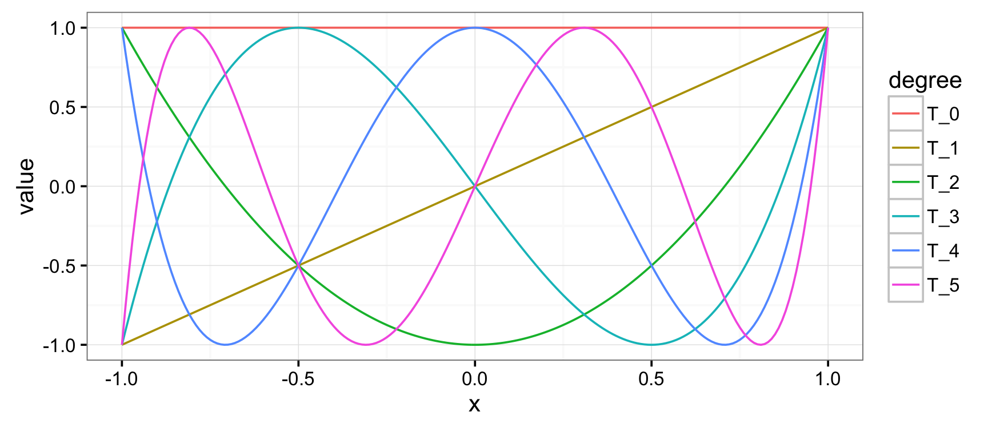

#### [Jacobi polynomials](http://en.wikipedia.org/wiki/Jacobi_polynomials)

``` r
s <- seq(-1, 1, length.out = 201); N <- 5
(jacPolys <- jacobi(0:N, 2, 2))
# 1
# 5 x
# 17.5 x^2  -  2.5
# 52.5 x^3  -  17.5 x
# 144.375 x^4  -  78.75 x^2  +  4.375
# 375.375 x^5  -  288.75 x^3  +  39.375 x
 
df <- as.function(jacPolys)(s) %>% cbind(s, .) %>% as.data.frame
# f(.) with . = (x)
names(df) <- c("x", paste0("P_", 0:N))
mdf <- df %>% gather(degree, value, -x)
qplot(x, value, data = mdf, geom = "path", color = degree) +
  coord_cartesian(ylim = c(-25, 25))
```

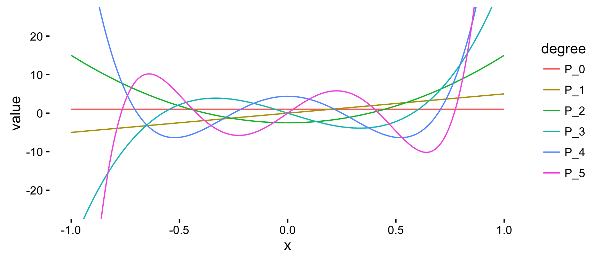

#### [Legendre polynomials](http://en.wikipedia.org/wiki/Legendre_polynomials)

``` r
s <- seq(-1, 1, length.out = 201); N <- 5
(legPolys <- legendre(0:N))
# 1
# x
# 1.5 x^2  -  0.5
# 2.5 x^3  -  1.5 x
# 4.375 x^4  -  3.75 x^2  +  0.375
# 7.875 x^5  -  8.75 x^3  +  1.875 x
 
df <- as.function(legPolys)(s) %>% cbind(s, .) %>% as.data.frame
# f(.) with . = (x)
names(df) <- c("x", paste0("P_", 0:N))
mdf <- df %>% gather(degree, value, -x)
qplot(x, value, data = mdf, geom = "path", color = degree)
```

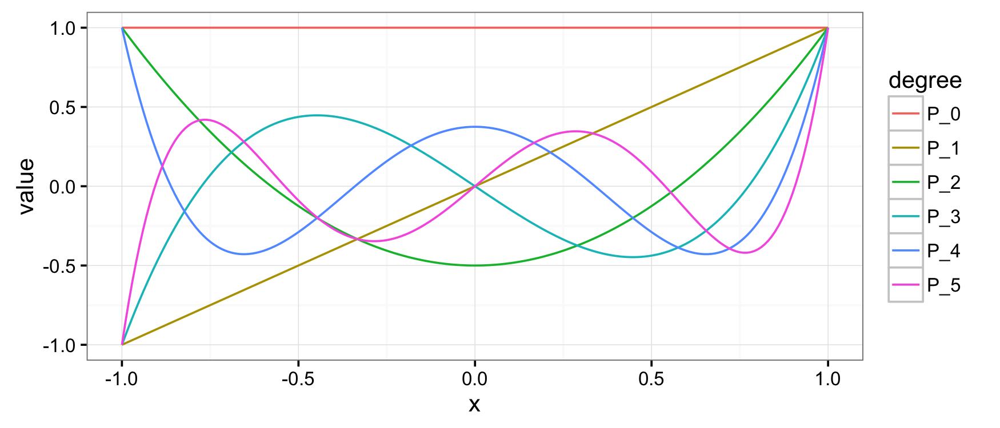

#### [Hermite polynomials](http://en.wikipedia.org/wiki/Hermite_polynomials)

``` r
s <- seq(-3, 3, length.out = 201); N <- 5
(hermPolys <- hermite(0:N))
# 1
# x
# x^2  -  1
# x^3  -  3 x
# x^4  -  6 x^2  +  3
# x^5  -  10 x^3  +  15 x

df <- as.function(hermPolys)(s) %>% cbind(s, .) %>% as.data.frame
# f(.) with . = (x)
names(df) <- c("x", paste0("He_", 0:N))
mdf <- df %>% gather(degree, value, -x)
qplot(x, value, data = mdf, geom = "path", color = degree)
```

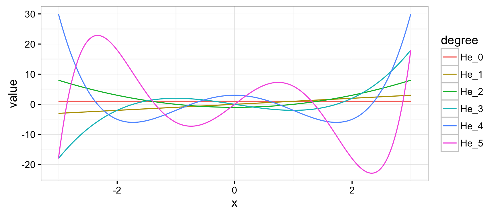

#### [(Generalized) Laguerre polynomials](http://en.wikipedia.org/wiki/Laguerre_polynomials)

``` r
s <- seq(-5, 20, length.out = 201); N <- 5
(lagPolys <- laguerre(0:N))
# 1
# -1 x  +  1
# 0.5 x^2  -  2 x  +  1
# -0.1666667 x^3  +  1.5 x^2  -  3 x  +  1
# 0.04166667 x^4  -  0.6666667 x^3  +  3 x^2  -  4 x  +  1
# -0.008333333 x^5  +  0.2083333 x^4  -  1.666667 x^3  +  5 x^2  -  5 x  +  1

df <- as.function(lagPolys)(s) %>% cbind(s, .) %>% as.data.frame
# f(.) with . = (x)
names(df) <- c("x", paste0("L_", 0:N))
mdf <- df %>% gather(degree, value, -x)
qplot(x, value, data = mdf, geom = "path", color = degree) +
  coord_cartesian(ylim = c(-25, 25))
```

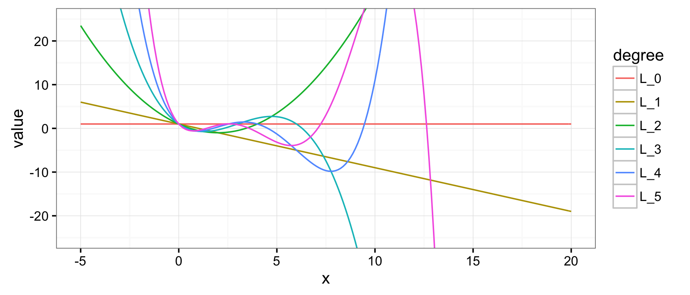

#### [Bernstein polynomials](http://en.wikipedia.org/wiki/Bernstein_polynomial)

[Bernstein polynomials](http://en.wikipedia.org/wiki/Bernstein_polynomial) are not in **polynom** or **orthopolynom** but are available in **mpoly** with `bernstein()`:

``` r
bernstein(0:4, 4)
# x^4  -  4 x^3  +  6 x^2  -  4 x  +  1
# -4 x^4  +  12 x^3  -  12 x^2  +  4 x
# 6 x^4  -  12 x^3  +  6 x^2
# -4 x^4  +  4 x^3
# x^4

s <- seq(0, 1, length.out = 101)
N <- 5 # number of bernstein polynomials to plot
(bernPolys <- bernstein(0:N, N))
# -1 x^5  +  5 x^4  -  10 x^3  +  10 x^2  -  5 x  +  1
# 5 x^5  -  20 x^4  +  30 x^3  -  20 x^2  +  5 x
# -10 x^5  +  30 x^4  -  30 x^3  +  10 x^2
# 10 x^5  -  20 x^4  +  10 x^3
# -5 x^5  +  5 x^4
# x^5

df <- as.function(bernPolys)(s) %>% cbind(s, .) %>% as.data.frame
# f(.) with . = (x)
names(df) <- c("x", paste0("B_", 0:N))
mdf <- df %>% gather(degree, value, -x)
qplot(x, value, data = mdf, geom = "path", color = degree)
```

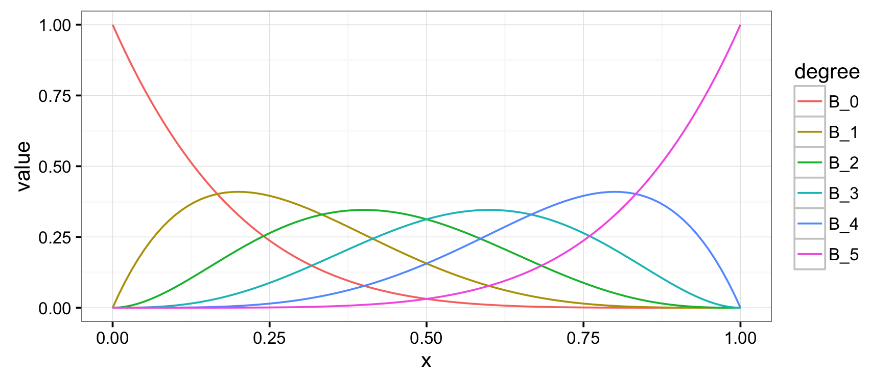

You can use the `bernsteinApprox()` function to compute the Bernstein polynomial approximation to a function. Here's an approximation to the standard normal density:

``` r
p <- bernsteinApprox(dnorm, 15, -1.25, 1.25)
round(p, 4)
# -0.1624 x^2  +  0.0262 x^4  -  0.002 x^6  +  0.0001 x^8  +  0.3796

x <- seq(-3, 3, length.out = 101)
df <- data.frame(
  x = rep(x, 2),
  y = c(dnorm(x), as.function(p)(x)),
  which = rep(c("actual", "approx"), each = 101)
)
# f(.) with . = x
qplot(x, y, data = df, geom = "path", color = which)
```

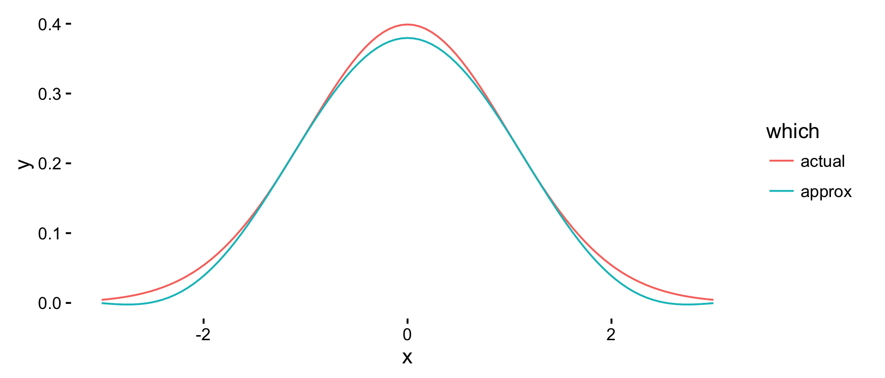

[Bezier polynomials and curves](http://en.wikipedia.org/wiki/Bézier_curve)
--------------------------------------------------------------------------

You can construct [Bezier polynomials](http://en.wikipedia.org/wiki/Bézier_curve) for a given collection of points with `bezier()`:

``` r
points <- data.frame(x = c(-1,-2,2,1), y = c(0,1,1,0))
(bezPolys <- bezier(points))
# -10 t^3  +  15 t^2  -  3 t  -  1
# -3 t^2  +  3 t
```

And viewing them is just as easy:

``` r
df <- as.function(bezPolys)(s) %>% as.data.frame

ggplot(aes(x = x, y = y), data = df) + 
  geom_point(data = points, color = "red", size = 4) +
  geom_path(data = points, color = "red", linetype = 2) +
  geom_path(size = 2)
```

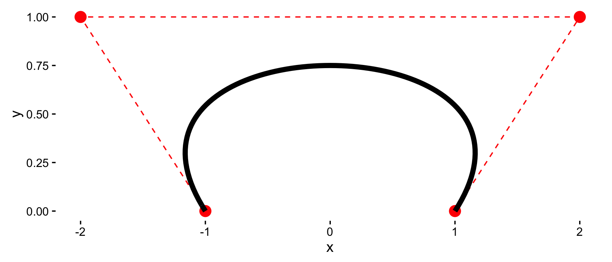

Weighting is available also:

``` r
points <- data.frame(x = c(1,-2,2,-1), y = c(0,1,1,0))
(bezPolys <- bezier(points))
# -14 t^3  +  21 t^2  -  9 t  +  1
# -3 t^2  +  3 t
df <- as.function(bezPolys, weights = c(1,5,5,1))(s) %>% as.data.frame

ggplot(aes(x = x, y = y), data = df) + 
  geom_point(data = points, color = "red", size = 4) +
  geom_path(data = points, color = "red", linetype = 2) +
  geom_path(size = 2)
```

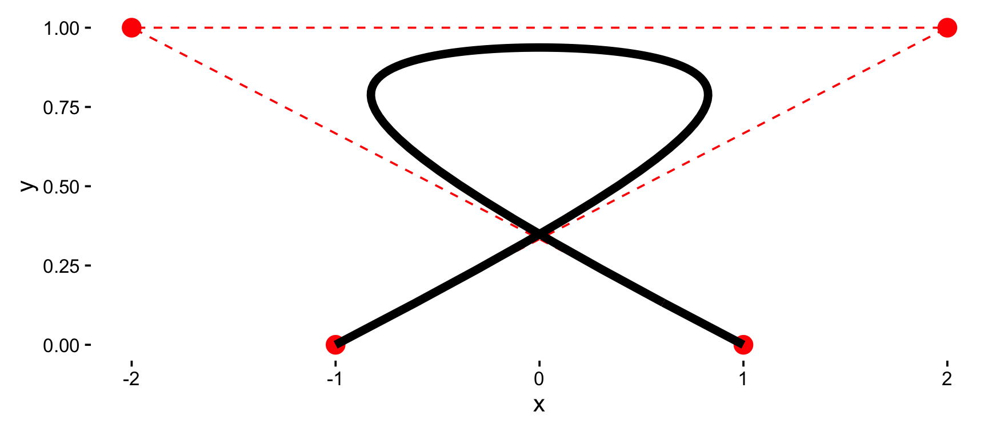

To make the evaluation of the Bezier polynomials stable, `as.function()` has a special method for Bezier polynomials that makes use of [de Casteljau's algorithm](http://en.wikipedia.org/wiki/De_Casteljau%27s_algorithm). This allows `bezier()` to be used as a smoother:

``` r
s <- seq(0, 1, length.out = 201) 
df <- as.function(bezier(cars))(s) %>% as.data.frame
qplot(speed, dist, data = cars) +
  geom_path(data = df, color = "red")
```

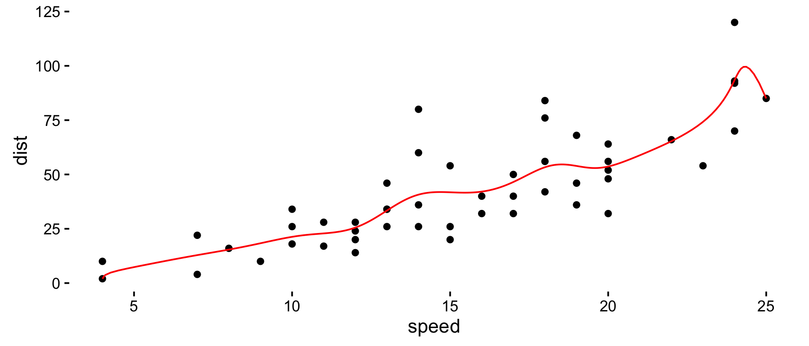

Other stuff
-----------

I'm starting to put in methods for some other R functions:

``` r
n <- 101
df <- data.frame(x = seq(-5, 5, length.out = n))
df$y <- with(df, -x^2 + 2*x - 3 + rnorm(n, 0, 2))

mod <- lm(y ~ x + I(x^2), data = df)
(p <- mod %>% as.mpoly %>% round)
# 2.021 x  -  0.979 x^2  -  3.507
qplot(x, y, data = df) +
  stat_function(fun = as.function(p), colour = 'red')
# f(.) with . = x
```

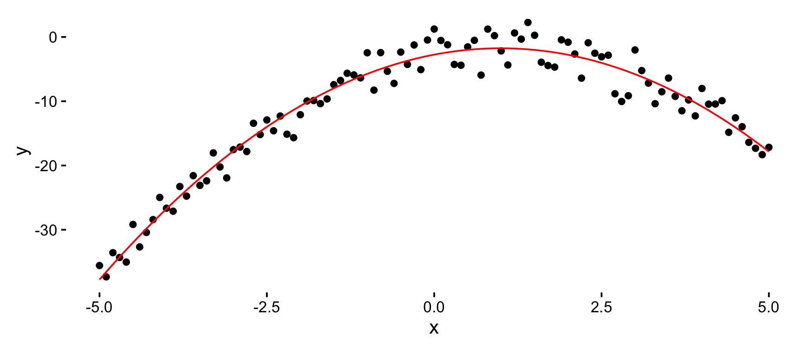

``` r
s <- seq(-5, 5, length.out = n)
df <- expand.grid(x = s, y = s) %>% 
  mutate(z = x^2 - y^2 + 3*x*y + rnorm(n^2, 0, 3))

(mod <- lm(z ~ poly(x, y, degree = 2, raw = TRUE), data = df))
# 
# Call:
# lm(formula = z ~ poly(x, y, degree = 2, raw = TRUE), data = df)
# 
# Coefficients:
#                           (Intercept)  
#                             -0.066621  
# poly(x, y, degree = 2, raw = TRUE)1.0  
#                              0.002571  
# poly(x, y, degree = 2, raw = TRUE)2.0  
#                              0.998949  
# poly(x, y, degree = 2, raw = TRUE)0.1  
#                              0.002239  
# poly(x, y, degree = 2, raw = TRUE)1.1  
#                              3.001249  
# poly(x, y, degree = 2, raw = TRUE)0.2  
#                             -0.987866
as.mpoly(mod)
# 0.002571436 x  +  0.9989494 x^2  +  0.002238815 y  +  3.001249 x y  -  0.9878661 y^2  -  0.06662147
```

Installation
------------

-   From CRAN: `install.packages("mpoly")`

-   From Github (dev version):

    ``` r
    # install.packages("devtools")
    devtools::install_github("dkahle/mpoly")
    ```
