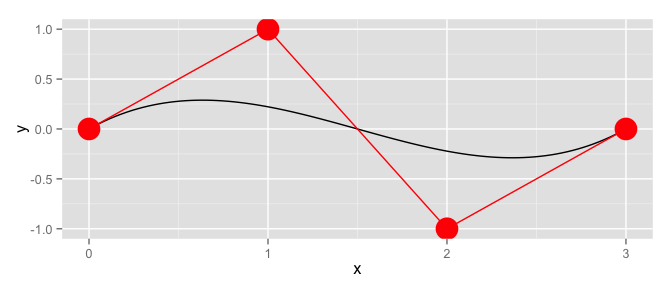

<!-- README.md is generated from README.Rmd. Please edit that file -->
mpoly
=====

Specifying polynomials
----------------------

**mpoly** is a simple collection of tools to help deal with multivariate polynomials *symbolically* and functionally in R. Polynomials are defined with the `mp` function:

``` r
library(mpoly)
#> Loading required package: stringr
mp("x + y")
#> x  +  y
mp("(x + 4y)^2 (x - .25)")
#> x^3  -  0.25 x^2  +  8 x^2 y  -  2 x y  +  16 x y^2  -  4 y^2
```

[Term orders](http://en.wikipedia.org/wiki/Lexicographical_order#Monomials) are available with the reorder function:

``` r
(p <- mp("(x + y)^2 (1 + x)"))
#> x^3  +  x^2  +  2 x^2 y  +  2 x y  +  x y^2  +  y^2
reorder(p, varorder = c('y','x'), order = 'lex')
#> y^2 x  +  y^2  +  2 y x^2  +  2 y x  +  x^3  +  x^2
reorder(p, varorder = c('x','y'), order = 'glex')
#> x^3  +  2 x^2 y  +  x y^2  +  x^2  +  2 x y  +  y^2
```

Vectors of polynomials (`mpolyList`s) can be specified in the same way:

``` r
mp(c("(x+y)^2", "z"))
#> x^2  +  2 x y  +  y^2
#> z
```

Polynomial arithmetic
---------------------

Arithmetic is defined for both polynomials (`+`, `-`, `*` and `^`)...

``` r
p1 <- mp("x + y")
p2 <- mp("x - y")

p1 + p2
#> 2 x
p1 - p2
#> 2 y
p1 * p2
#> x^2  -  y^2
p1^2
#> x^2  +  2 x y  +  y^2
```

... and vectors of polynomials:

``` r
(ps1 <- mp(c("x", "y")))
#> x
#> y
(ps2 <- mp(c("2x", "y+z")))
#> 2 x
#> y  +  z
ps1 + ps2
#> 3 x
#> 2 y  +  z
ps1 - ps2
#> -1 x
#> -1 z
ps1 * ps2
#> 2 x^2
#> y^2  +  y z
```

Some calculus
-------------

You can compute derivatives easily:

``` r
p <- mp("x + x y + x y^2")
deriv(p, "y")
#> x  +  2 x y
gradient(p)
#> y  +  y^2  +  1
#> x  +  2 y x
```

Function coercion
-----------------

You can turn polynomials and vectors of polynomials into functions you can evaluate with `as.function()`. For example, you can visualize a univariate polynomials like this:

``` r
f <- as.function(mp("(x-2) x (x+2)"))
#> f(x)
s <- seq(-2.5, 2.5, .1)
df <- expand.grid(x = s)
df$f <- apply(df, 1, f)

library(ggplot2)
qplot(x, f, data = df, geom = "line")
```


Or a bivariate polynomial like this:

``` r
f <- as.function(mp("x^2 - y^2")) 
#> f(.) with . = (x, y)
df <- expand.grid(x = s, y = s)
df$f <- apply(df, 1, f)
qplot(x, y, data = df, geom = "tile", fill = f)
```


Algebraic geometry
------------------

Grobner bases computations are available using **rSymPy**:

``` r
polys <- mp(c("t^4 - x", "t^3 - y", "t^2 - z"))
grobner(polys)
#> using variable ordering - t, x, y, z
#> Loading required package: rJava
#> -1 z  +  t^2
#> t y  -  z^2
#> -1 y  +  z t
#> x  -  z^2
#> y^2  -  z^3
```

Special polynomials
-------------------

You can construct [Chebyshev polynomials](http://en.wikipedia.org/wiki/Chebyshev_polynomials) as follows:

``` r
chebyshev(1)
#> x
chebyshev(2)
#> 2 x^2  -  1
chebyshev(0:5)
#> 1
#> x
#> 2 x^2  -  1
#> 4 x^3  -  3 x
#> 8 x^4  -  8 x^2  +  1
#> 16 x^5  -  20 x^3  +  5 x
```

And you can visualize them:

``` r
library(reshape2)

s <- seq(-1, 1, length.out = 201)
N <- 5 # number of chebyshev polynomials to plot
(chebPolys <- chebyshev(0:N))
#> 1
#> x
#> 2 x^2  -  1
#> 4 x^3  -  3 x
#> 8 x^4  -  8 x^2  +  1
#> 16 x^5  -  20 x^3  +  5 x

df <- t(sapply(s, as.function(chebPolys)) )
#> f(x)
df <- as.data.frame(cbind(s, df))
names(df) <- c("x", paste0("T_", 0:N))
mdf <- melt(df, id = "x")
qplot(x, value, data = mdf, geom = "line", color = variable)
```


[Bernstein polynomials](http://en.wikipedia.org/wiki/Bernstein_polynomial) are available with `bernstein()`:

``` r
bernstein(0:4, 4)
#> x^4  -  4 x^3  +  6 x^2  -  4 x  +  1
#> -4 x^4  +  12 x^3  -  12 x^2  +  4 x
#> 6 x^4  -  12 x^3  +  6 x^2
#> -4 x^4  +  4 x^3
#> x^4

s <- seq(0, 1, length.out = 101)
N <- 5 # number of bernstein polynomials to plot
(bernPolys <- bernstein(0:N, N))
#> -1 x^5  +  5 x^4  -  10 x^3  +  10 x^2  -  5 x  +  1
#> 5 x^5  -  20 x^4  +  30 x^3  -  20 x^2  +  5 x
#> -10 x^5  +  30 x^4  -  30 x^3  +  10 x^2
#> 10 x^5  -  20 x^4  +  10 x^3
#> -5 x^5  +  5 x^4
#> x^5

df <- t(sapply(s, as.function(bernPolys)) )
#> f(x)
df <- as.data.frame(cbind(s, df))
names(df) <- c("x", paste0("B_", 0:N))
mdf <- melt(df, id = "x")
qplot(x, value, data = mdf, geom = "line", color = variable)
```


You can use the `bernsteinApprox()` function to compute the Bernstein polynomial approximation to a function. Here's an approximation to the standard normal density:

``` r
p <- bernsteinApprox(dnorm, 15, -1.25, 1.25)
round(p, 4)
#> 0.0001 x^8  -  0.002 x^6  +  0.0262 x^4  -  0.1624 x^2  +  0.3796

x <- seq(-3, 3, length.out = 101)
df <- data.frame(
  x = rep(x, 2),
  y = c(dnorm(x), as.function(p)(x)),
  which = rep(c("actual", "approx"), each = 101)
)
#> f(x)
qplot(x, y, data = df, geom = "line", color = which)
```


Bezier polynomials and curves
-----------------------------

You can construct [Bezier polynomials](http://en.wikipedia.org/wiki/Bézier_curve) for a given collection of points with `bezier()`:

``` r
points <- data.frame(x = c(-1,-2,2,1), y = c(0,1,1,0))
(bezPolys <- bezier(points))
#> -10 t^3  +  15 t^2  -  3 t  -  1
#> -3 t^2  +  3 t
```

And viewing them is just as easy:

``` r
df <- t(sapply(s, as.function(bezPolys)) )
#> f(t)
df <- as.data.frame(df)
names(df) <- c("x", "y")
qplot(x, y, data = df, geom = "path") +
  geom_path(data = points, color = "red") +
  geom_point(data = points, color = "red", size = 4)
```



Other stuff
-----------

I'm starting to put in methods for some other R functions:

``` r
n <- 101
df <- data.frame(x = seq(-5, 5, length.out = n))
df$y <- with(df, -x^2 + 2*x - 3 + rnorm(n, 0, 2))

mod <- lm(y ~ x + I(x^2), data = df)
(p <- round(as.mpoly(mod)))
#> 1.871 x  -  0.953 x^2  -  3.628
qplot(x, y, data = df) +
  stat_function(fun = as.function(p), colour = 'red')
#> f(x)
```


``` r


df <- df %>% dplyr::arrange(x)
bezier(df)
#> 28872395762264 t^100  -  5550227924394919 t^99  +  257524164448643584 t^98  -  5486432867534512128 t^97  +  86208461136174137344 t^96  -  973010044920159272960 t^95  +  8952262427000620187648 t^94  -  67665901937709090340864 t^93  +  413990207181983714377728 t^92  -  2169648063017396838858752 t^91  +  10215623171201757442211840 t^90  -  39429210673083588267737088 t^89  +  150081716298764745747464192 t^88  -  473299688194303653230673920 t^87  +  1348855346913026284370001920 t^86  -  3156830666010080949250818048 t^85  +  6855660878345967534732214272 t^84  -  13080372818096327189527003136 t^83  +  20394058314951326409859006464 t^82  -  27256940070137478833571364864 t^81  +  6459914346417121991722008576 t^80  +  103388391896093539120996941824 t^79  -  219369275208381341256969617408 t^78  +  529849505358297756001170882560 t^77  -  783428481883374495840442777600 t^76  +  743090679812620047625041739776 t^75  -  558818244850077171250341347328 t^74  -  588500412268868497049934364672 t^73  +  3075636049710386057135895085056 t^72  -  7954610812548359449273008390144 t^71  +  13677856902254243196614922469376 t^70  -  22742902163759437548928928579584 t^69  +  29929099021496484473668200562688 t^68  -  40005171731953237029066377265152 t^67  +  47864067339349913582343674658816 t^66  -  51094400443405685832525870530560 t^65  +  51957289803458760243366821101568 t^64  -  48565193792952596399581174956032 t^63  +  43648217566029392046514679840768 t^62  -  34783739347831105551196491874304 t^61  +  28524044080840596297641296396288 t^60  -  20172097643046226110678755704832 t^59  +  14199159114177952601400772919296 t^58  -  8752251235151295733634829385728 t^57  +  5404985595102540094976567541760 t^56  -  3070974734811738428743587201024 t^55  +  1645724795326103330266139328512 t^54  -  788503307288013844192474169344 t^53  +  360516598093264815070812045312 t^52  -  192040539511304517416065695744 t^51  +  66611726612375980764529950720 t^50  -  22841552835608605503606751232 t^49  +  10698167749078122504405385216 t^48  -  2905945292218340066841329664 t^47  +  902063553696400928183156736 t^46  -  154027121108748591477817344 t^45  +  45438717983452145232379904 t^44  +  42490471362746196848279552 t^43  -  8260557059996748884213760 t^42  -  3680409646682820482957312 t^41  +  611482392671321338150912 t^40  +  314313161988459437490176 t^39  -  223528014571938540158976 t^38  +  27122143965670591692800 t^37  +  179189880031526518784 t^36  -  1379147002511253045248 t^35  -  734604924935349469184 t^34  -  379871758682612039680 t^33  -  23546653524482850816 t^32  +  3419556788167507968 t^31  +  57207736022073344 t^30  +  509180901360402432 t^29  +  80997336536317952 t^28  -  862389167718400 t^27  +  2496312570281984 t^26  +  628358949896192 t^25  -  139691160502272 t^24  -  22050261434368 t^23  -  1118587322368 t^22  +  250315014144 t^21  -  18695323648 t^20  +  10307043328 t^19  -  1029865472 t^18  +  80531456 t^17  -  24364032 t^16  +  514688 t^15  +  36608 t^14  +  6776 t^13  -  1372 t^12  +  4 t^11  -  0.1240234 t^9  +  0.0078125 t^8  +  0.00006103516 t^7  -  0.0000004768372 t^5  +  10 t  -  5
#> 146119339006571593841908908032 t^100  -  9052993123300511185001802366976 t^99  +  258890263388882321170852910989312 t^98  -  4644505162723090726041667961356288 t^97  +  59328260021285178441534195506348032 t^96  -  577498189580520622981541729012809728 t^95  +  4459001112710313504643096203457724416 t^94  -  27955957690961140948639986825203548160 t^93  +  143726908114189506885049154896184475648 t^92  -  601938380475435973503944133304198889472 t^91  +  1973645403957173468215817177767555891200 t^90  -  4325414094436173511883452102198297624576 t^89  +  76434897879047818847955078785695481856 t^88  +  59742303414625376702068432741863790739456 t^87  -  386851089029387030305064465736878006468608 t^86  +  1716119456991726705144632828455612347056128 t^85  -  6217610364858308710777711601227471830122496 t^84  +  19490628356895376418715439082002349364871168 t^83  -  54343747414259822786674262520302828903202816 t^82  +  136972875428532002272446684621359417099550720 t^81  -  315498465382762831060978792350391954554486784 t^80  +  669430043632520909956774097669601290532945920 t^79  -  1316687902800249594620656554779100061523509248 t^78  +  2413072735840781636988348005847263543233085440 t^77  -  4138667032764027933531350001121829026885795840 t^76  +  6667564117755207575708752378099655639836917760 t^75  -  10121761261290671097074653368616496308477231104 t^74  +  14516160420953502794917677689565243843809378304 t^73  -  19707690988852083668739226942022634957105528832 t^72  +  25365546498225877695348522063612012953581125632 t^71  -  30979361129142222438246386929432916102228213760 t^70  +  35916117937794153877086283828607379716666556416 t^69  -  39524115958635855803602507863419176836891934720 t^68  +  41265508459661637654736132701251859480838144000 t^67  -  40843471572069647194107401908046940782957953024 t^66  +  38283958814905014394153025531150057212062203904 t^65  -  33941272660675192227066230073503857164955942912 t^64  +  28420564156219200398851220088826255793633361920 t^63  -  22439741304152206986854272169345569829408473088 t^62  +  16674689402433541551267958506590875274692263936 t^61  -  11635018943671023293085622184664346155699666944 t^60  +  7601917617031773761013777587150521794918612992 t^59  -  4633801620216207999300235175075061792426164224 t^58  +  2622024414547700776611793231688878574192820224 t^57  -  1367301737620248210203743530395647900502720512 t^56  +  649652076696979816916800731991171794951208960 t^55  -  275762164263142887290069388412359413094940672 t^54  +  100503330339833305291890572003136251042463744 t^53  -  28321142972184518184031202915279146504421376 t^52  +  3544152280138326425287274305503824227336192 t^51  +  2469752680654340657479410596975219256066048 t^50  -  2547852663838847699445689121824483043180544 t^49  +  1504887263892687677628777529533082579763200 t^48  -  696519481688293780438949851783924958625792 t^47  +  270250211931600806985501946103807348834304 t^46  -  89473396233664857364969366870114441363456 t^45  +  25317676533245651330223308449770113073152 t^44  -  6211757960229727843754380966241157251072 t^43  +  1494225342090384407280836343474205753344 t^42  -  505737850611212596798650861441553268736 t^41  +  267991679826488082231156420155252146176 t^40  -  153725345696327149439712307680473251840 t^39  +  78833197952115186176975145652138803200 t^38  -  35246287955451830874329458612778303488 t^37  +  13899578689680273353413579448571133952 t^36  -  4902823691638931339968308363386683392 t^35  +  1563862912332382250459852405410365440 t^34  -  454722421606916618561464771683549184 t^33  +  121263749688414783808332704069451776 t^32  -  29810876132527843207466647623303168 t^31  +  6790087027147339906844867432546304 t^30  -  1441293578644712931696213653192704 t^29  +  287121402603124592799878664421376 t^28  -  54116264535752785182897377116160 t^27  +  9725241658655918011200319782912 t^26  -  1674309264983306903391874056192 t^25  +  275792887800966714156258426880 t^24  -  43078571199000096066815131648 t^23  +  6277002560254655592231075840 t^22  -  833438495131151102273126400 t^21  +  97479500515929473989738496 t^20  -  9448567237188495188426752 t^19  +  639288021581396466204672 t^18  -  1708971636148763099136 t^17  -  8444144582188368658432 t^16  +  1743600971687622082560 t^15  -  242216004302287077376 t^14  +  26818828941335576576 t^13  -  2481253221762149888 t^12  +  194702235039416096 t^11  -  12959164405515508 t^10  +  724415860637840 t^9  -  33472119409972 t^8  +  1266075854045 t^7  -  40472129130 t^6  +  1226802237 t^5  -  38175415 t^4  +  1043890 t^3  -  22232.3 t^2  +  570.2998 t  -  42.21907
```

Installation
------------

-   From CRAN: `install.packages("mpoly")`

-   From Github (dev version):

    ``` r
    # install.packages("devtools")
    devtools::install_github("Rexamine/stringi")
    devtools::install_github("hadley/stringr")
    devtools::install_github("dkahle/mpoly")
    ```
